# 🛡️ Enterprise Web Security Headers Scanner
### Passive & Defensive HTTP Security Auditor conforming to OWASP ASVS 4.0 Standards

[](https://www.python.org/)
[](https://en.wikipedia.org/wiki/Multitier_architecture)
[](https://github.com/astral-sh/ruff)
[](https://owasp.org/)
[](https://opensource.org/licenses/MIT)

---

```text
      ___ ___ ___ _   _ ___ ___ _____   __  _  _ ___   _   ___  ___ ___  ___ 
     / __| __/ __| | | | _ \_ _|_   _\ \/ / | || |   \ /_\ | _ \/ __| __|/ __|
     \__ \ _| (__| |_| |   /| |  | |  \  /  | __ | |) / _ \|   / (__| _| \__ \
     |___/___\___|\___/|_|_\___| |_|  /_/   |_||_|___/_/ \_\_|_\\___|___||___/
                  PASSIVE AUDITOR FOR ENTERPRISE CYBERDEFENSE
```

---

## 🛑 Uso Permitido y Descargo de Responsabilidad (Cyber-Safety Notice)

> [!IMPORTANT]
> **ESTE SOFTWARE ES UNA HERRAMIENTA EXCLUSIVAMENTE DEFENSIVA Y PASIVA.**
> Su uso está diseñado y estrictamente autorizado para la auditoría de infraestructuras propias, redes internas organizacionales o activos web bajo consentimiento previo expreso (reglas de engagement).
> 
> * **Comportamiento Pasivo**: No realiza inyección de payloads, no ejecuta secuencias de comandos remotas, no realiza ataques de denegación de servicio (DoS/DDoS) ni fuzzing invasivo.
> * **Optimización de Tráfico**: Realiza una petición GET segura de tipo *streaming* (`stream=True`) para inspeccionar cabeceras de respuesta HTTP del servidor sin descargar el cuerpo del documento HTML, mitigando el impacto en el ancho de banda del auditado.

---

## 🏗️ Clean Architecture & SOLID Design Pattern

La herramienta está desarrollada bajo los principios de la **Clean Architecture** de Robert C. Martin, garantizando que el núcleo de negocio sea 100% independiente de frameworks, bases de datos y librerías de infraestructura.

### Diagrama de Flujo y Dependencias

```mermaid
graph TD
    subgraph Capa_Presentacion [Capa de Presentación / CLI]
        CLI[presentation/cli.py] --> Main[main.py]
    end

    subgraph Capa_Aplicacion [Capa de Aplicación]
        UseCase[use_cases/scan_security_headers_use_case.py]
        ValService[services/url_validator_service.py]
        AnaService[services/security_header_analyzer_service.py]
        CalcService[services/score_calculator_service.py]
        RecService[services/recommendation_service.py]
        
        ReaderInt[interfaces/url_reader_interface.py]
        ClientInt[interfaces/http_client_interface.py]
        ExportInt[interfaces/report_exporter_interface.py]
    end

    subgraph Capa_Dominio [Capa del Dominio - Core del Sistema]
        Target[entities/scan_target.py]
        Result[entities/header_check_result.py]
        Report[entities/scan_report.py]
        Grade[value_objects/security_grade.py]
        Status[value_objects/header_status.py]
        Ex[exceptions/domain_exceptions.py]
    end

    subgraph Capa_Infraestructura [Capa de Infraestructura - Adapters]
        TXTReader[readers/txt_url_reader.py]
        HttpClient[http/requests_http_client.py]
        ExcelExporter[exporters/excel_report_exporter.py]
        JSONExporter[exporters/json_report_exporter.py]
        DirManager[filesystem/directory_manager.py]
    end

    %% Flujo de Dependencias e Inversión
    CLI --> UseCase
    UseCase --> ValService
    UseCase --> AnaService
    UseCase --> CalcService
    UseCase --> RecService
    
    UseCase --> ReaderInt
    UseCase --> ClientInt
    UseCase --> ExportInt

    TXTReader -.-> ReaderInt
    HttpClient -.-> ClientInt
    ExcelExporter -.-> ExportInt
    JSONExporter -.-> ExportInt

    %% Relaciones al Dominio
    UseCase --> Target
    UseCase --> Report
    AnaService --> Result
    CalcService --> Grade
    AnaService --> Status
```



---

## 🔍 Matriz OWASP Top 10 & Directivas Auditadas

El escáner evalúa las cabeceras HTTP que mitigan directamente los riesgos del **OWASP Top 10:2021**:

### Mapeo de Seguridad

| Cabecera HTTP | Categoría OWASP | Puntos | Valores Recomendados / Directivas Evaluadas |
| :--- | :--- | :---: | :--- |
| **`Content-Security-Policy` (CSP)** | **A03:2021-Injection**<br>**A05:2021-Security Misconfiguration** | **20** | Valida la presencia de directivas críticas (`default-src`, `script-src`, `object-src`, etc.). Alerta sobre la presencia de valores inseguros (`'unsafe-inline'`, `'unsafe-eval'`) y comodines genéricos (`*`). |
| **`Strict-Transport-Security` (HSTS)** | **A02:2021-Cryptographic Failures** | **15** | Requiere conexiones HTTPS forzadas con un `max-age` mínimo de 1 año (`31536000`s), incluyendo `includeSubDomains` y `preload`. |
| **`X-Frame-Options` (XFO)** | **A05:2021-Security Misconfiguration** | **10** | Previene secuestros de clics (Clickjacking). Solo se aceptan los valores altamente restrictivos `DENY` o `SAMEORIGIN`. |
| **`X-Content-Type-Options`** | **A05:2021-Security Misconfiguration** | **10** | Previene ataques de sniffing de tipos MIME en navegadores viejos. Requiere estrictamente `nosniff`. |
| **`Referrer-Policy`** | **A04:2021-Insecure Design** | **10** | Evita la fuga de URLs y parámetros de consulta a terceros. Recomienda `strict-origin-when-cross-origin` o `no-referrer`. |
| **`Permissions-Policy`** | **A05:2021-Security Misconfiguration** | **10** | Restringe APIs invasivas del dispositivo (cámara, micrófono, geolocalización, usb). |
| **`COOP / CORP / COEP`** | **A04:2021-Insecure Design** | **15** | Aísla el contexto del navegador para mitigar ataques Spectre o XS-Leaks. *(5 pts cada uno: `same-origin`, `same-origin` / `same-site`, `require-corp`)*. |
| **`Set-Cookie`** | **A07:2021-Identification & Auth Failures** | **10** | Si existen cookies de sesión, exige los flags de defensa en profundidad: `HttpOnly`, `Secure` y `SameSite` (Lax/Strict). *(100% de puntos otorgados si el sitio no establece cookies).* |
| **`Cache-Control`** | **A05:2021-Security Misconfiguration** | **Info** | *Auditoría Contextual*: Verifica si se restringe la caché en navegadores compartidos para rutas sensibles (`no-store`, `no-cache`, `private`). |

---

## 📊 Matriz de Clasificación de Seguridad (Umbrales)

El puntaje acumulado clasifica la postura defensiva del activo bajo las siguientes categorías ejecutivas:

```
 Puntuación Acumulada
 ┌────────────────────────────────────────────────────────────────────────┐
 │  0 - 49 pts      │   50 - 74 pts      │   75 - 89 pts    │  90 - 100 pts│
 ├──────────────────┼────────────────────┼──────────────────┼──────────────┤
 │  🔴 RIESGOSO     │   🟡 REGULAR       │   🔵 BUENO       │  🟢 EXCELENTE│
 └────────────────────────────────────────────────────────────────────────┘
```

* 🟢 **Excelente (90 - 100)**: Protección integral de cabeceras, defensa robusta ante XSS y aislamiento de procesos del navegador.
* 🔵 **Bueno (75 - 89)**: Las defensas base están presentes, pero se pueden afinar directivas específicas de CSP o HSTS.
* 🟡 **Regular (50 - 74)**: Ausencia de aislamiento cross-origin o políticas restrictivas débiles.
* 🔴 **Riesgoso (0 - 49)**: Alta vulnerabilidad a ataques de Clickjacking, secuestro de cookies e inyecciones maliciosas.

---

## ⚙️ Variables de Entorno y Configuración Avanzada

El sistema es altamente configurable a través de variables de entorno (con soporte para archivos `.env`), definidas centralmente en `app/config/settings.py`:

| Variable de Entorno | Descripción | Valor por Defecto |
| :--- | :--- | :--- |
| `SCANNER_INPUT_DIR` | Ruta de la carpeta de insumos. | `./datos_entrada` |
| `SCANNER_OUTPUT_DIR` | Ruta de la carpeta de reportes generados. | `./datos_salida` |
| `SCANNER_URLS_FILENAME` | Nombre del archivo de URLs a auditar. | `urls.txt` |
| `SCANNER_TIMEOUT` | Tiempo límite de espera de respuestas HTTP (segundos). | `10` |
| `SCANNER_FOLLOW_REDIRECTS` | Sigue redireccionamientos automáticos en peticiones HTTP. | `True` |
| `SCANNER_VERIFY_SSL` | Activa la validación estricta de certificados SSL/TLS. | `True` |
| `SCANNER_USER_AGENT` | Firma del navegador enviada en la auditoría. | *WebSecurityHeadersScanner/1.0* |
| `SCANNER_AUTO_HTTPS` | Antepone automáticamente `https://` a dominios crudos. | `True` |
| `SCANNER_REPORT_NAME` | Prefijo base de los reportes generados. | `security_headers_report` |

---

## 🛠️ Instalación y Setup en 3 Pasos

### Paso 1: Clonar e Inicializar Entorno Virtual
Crea un entorno de ejecución aislado para evitar conflictos de paquetes globales:
```bash
# Windows (PowerShell)
python -m venv venv
.\venv\Scripts\activate

# Linux / macOS
python -m venv venv
source venv/bin/activate
```

### Paso 2: Instalar Dependencias del Ecosistema
El proyecto utiliza dependencias empresariales optimizadas para persistencia y auditoría:
```bash
pip install -r requirements.txt
```

### Paso 3: Configurar Objetivos de Auditoría
En tu primera ejecución, el sistema detectará la ausencia del archivo de entrada y creará automáticamente una plantilla semilla en `datos_entrada/urls.txt`. Puedes abrir el archivo y definir tus dominios utilizando comentarios `#` para una mejor gestión de activos:
```txt
# ==============================================================
# AUDITORÍA DEFENSIVA DE PRODUCCIÓN - CORPORACIÓN SUR
# ==============================================================
https://example.com
https://httpbin.org

# Sitios de desarrollo interno (normalización automática a HTTPS)
owasp.org
```

---

## 🚀 Ejecución y Visualización Operativa

Ejecuta el pipeline del scanner con el siguiente comando:
```bash
python -m app.main
```

### Logs de Consola Premium en Tiempo Real
La consola muestra un seguimiento detallado basado en niveles de trazabilidad y marcas de tiempo:
```text
================================================================================
  WEB SECURITY HEADERS SCANNER - AUDITORÍA DE SEGURIDAD PASIVA (OWASP)
================================================================================
[2026-05-25 00:31:05] [INFO] - Leyendo URLs desde D:\PROYECTO TERMINADOS Y SUBIDOS\datos_entrada\urls.txt...
[2026-05-25 00:31:05] [INFO] - URLs encontradas: 3 (Válidas para escaneo: 3)
[2026-05-25 00:31:05] [INFO] - Validando URLs e iniciando peticiones HTTP...
[2026-05-25 00:31:05] [INFO] - Analizando headers de: https://example.com
[2026-05-25 00:31:05] [INFO] - Headers analizados correctamente para https://example.com
[2026-05-25 00:31:05] [INFO] - Calculando score de seguridad para https://example.com...
...
[2026-05-25 00:31:06] [INFO] - Generando reporte Excel...
[2026-05-25 00:31:06] [INFO] - Reporte Excel exportado en: .../datos_salida/security_headers_report.xlsx
[2026-05-25 00:31:06] [INFO] - Generando reporte JSON...
[2026-05-25 00:31:06] [INFO] - Reporte JSON exportado en: .../datos_salida/security_headers_report.json
[2026-05-25 00:31:06] [INFO] - Proceso finalizado
```

---

## 📊 Arquitectura de los Reportes Generados

### 📈 Reporte Corporativo Microsoft Excel (`security_headers_report.xlsx`)
Diseñado con estilos premium bajo una paleta **Navy Blue (Ciberseguridad)**, fuentes corporativas (Calibri/Inter), autoajuste dinámico de anchos de columna y alineaciones estructuradas. Se divide en cuatro hojas cohesivas:

#### Hoja 1: Resumen Ejecutivo
Visión panorámica de la postura defensiva global de todos los dominios analizados.
* *Estructura*: `url`, `final_url`, `status_code`, `score`, `clasificación` (Excellent/Good/Regular/Riesgoso), `total_headers_evaluados`, `headers_correctos`, `headers_faltantes`, `headers_debiles`, `error`, `fecha_analisis`.

#### Hoja 2: Detalle Técnico de Cabeceras
El desglose granular de cada regla analizada por cada activo web.
* *Estructura*: `url`, `header`, `presente` (Sí/No), `valor`, `estado` (Correcto, Débil, Faltante), `severidad` (Alta, Media, Baja, Info), `recomendación`.

#### Hoja 3: Roadmap de Mitigación priorizado
El listado consolidado de vulnerabilidades de configuración ordenadas por severidad prioritaria (**Alta prioridad primero**), sirviendo como un plan de acción directo para el departamento de TI.
* *Estructura*: `url`, `prioridad` (ALTA/MEDIA/BAJA), `header`, `problema`, `recomendación`.

#### Hoja 4: Registro de Errores e Infraestructura
El registro seguro de los sitios inalcanzables, caídas, o problemas de red.
* *Estructura*: `url`, `tipo_error` (SSL/TLS Fail, Timeout, Connection Refused), `mensaje_error`, `fecha_analisis`.

### 💾 Reporte JSON Completo (`security_headers_report.json`)
Ideal para ser procesado o ingerido de forma automatizada por sistemas externos (SIEM, Slack webhooks, dashboards corporativos, etc.), tabulado a 4 espacios y compatible con UTF-8:
```json
[
    {
        "url": "https://example.com",
        "final_url": "https://example.com",
        "status_code": 200,
        "score": 100,
        "classification": "Excelente",
        "error_message": null,
        "scan_date": "2026-05-25 00:31:05",
        "results": [
            {
                "header_name": "Content-Security-Policy",
                "present": true,
                "value": "default-src 'self'",
                "status": "CORRECTO",
                "severity": "INFO",
                "recommendation": "Content-Security-Policy configurado correctamente con directivas fuertes."
            }
        ]
    }
]
```

---

## 🧪 Suite de Aseguramiento de Calidad (Testing & Quality)

El proyecto cuenta con una cobertura rigurosa para garantizar la estabilidad y la no regresión de la base de código.

### Ejecutar Suite de Pytest
Para comprobar la salud del proyecto ejecutando todos los tests unitarios y de integración:
```bash
python -m pytest
```

### Garantía de Estilo y Linteado (Ruff Standards)
La base de código está 100% libre de advertencias de calidad o complejidad cognitiva gracias a las estrictas reglas de `Ruff` (E, F, B, I, C90, N, UP, A, S, PT, ARG, PTH) configuradas en el archivo `pyproject.toml`.

```bash
# Validar linter
ruff check .

# Formatear archivos
ruff format .
```

---

## 📖 Guía de Extensibilidad para Desarrolladores

Añadir una nueva cabecera HTTP a la auditoría es sumamente sencillo gracias a la arquitectura modular:

### Paso 1: Definir Cabecera y Peso
Abre `app/shared/constants.py` y añade el nombre del header y su peso de puntuación (asegúrate de reajustar los pesos globales para mantener el total de 100 si deseas incluirlo en el scoring):
```python
HEADER_MY_NEW_HEADER: Final[str] = "X-My-New-Security-Header"
SCORING_WEIGHTS[HEADER_MY_NEW_HEADER] = 5
```

### Paso 2: Crear Método Analítico
Abre `app/application/services/security_header_analyzer_service.py` y define el método analítico en base a las especificaciones OWASP:
```python
def _analyze_my_new_header(self, value: Optional[str]) -> HeaderCheckResult:
    if not value:
        return HeaderCheckResult(HEADER_MY_NEW_HEADER, False, "", HeaderStatus.FALTANTE, SEVERITY_MEDIUM, "Implementar X-My-New-Security-Header...")
    # ... Tu lógica analítica de robustez del header ...
```

### Paso 3: Agregar al Registro de Análisis
En el método `analyze` del mismo archivo, añade el método analítico al listado de cabeceras evaluadas:
```python
results.append(self._analyze_my_new_header(normalized_headers.get(HEADER_MY_NEW_HEADER.lower())))
```
¡Eso es todo! La nueva cabecera formará parte automáticamente del cálculo del score, recomendaciones y de los reportes en Excel y JSON.
